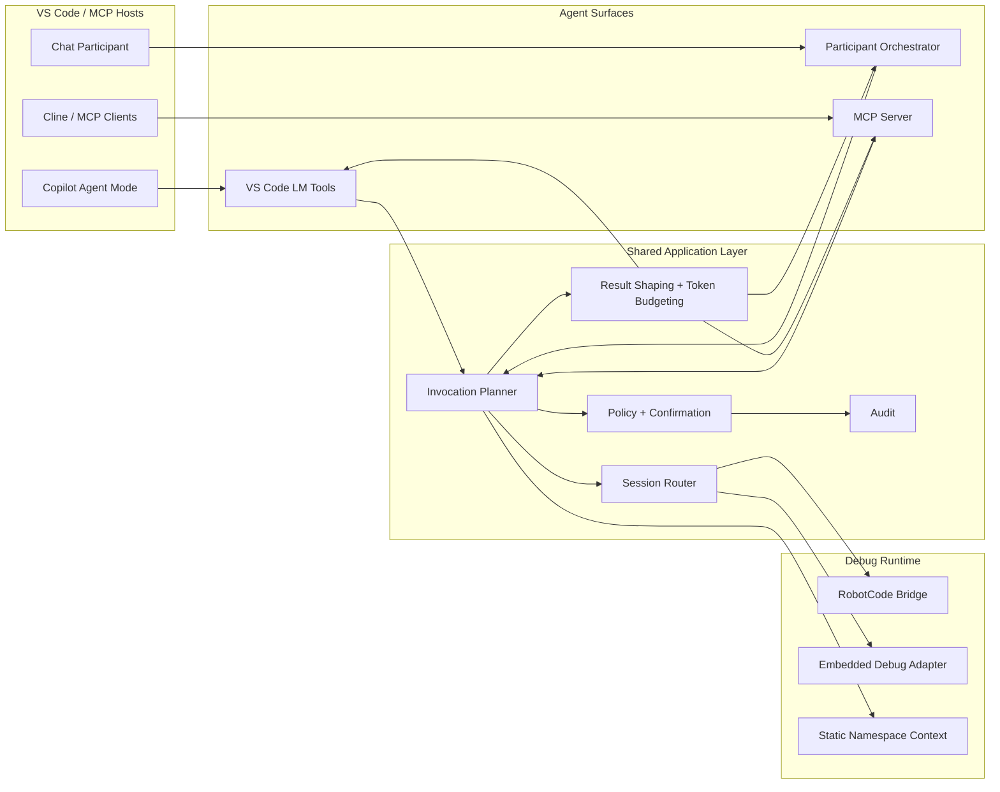

# Chat Agents Context Map

## Boundary Rules

1. Agent surfaces must not embed runtime business rules directly.
2. The chat participant may orchestrate tools, but must not bypass policy.
3. MCP-specific concerns such as prompts or resources must not leak into the core debug domain.
4. Result shaping is a first-class application concern because agents are token-constrained consumers.
