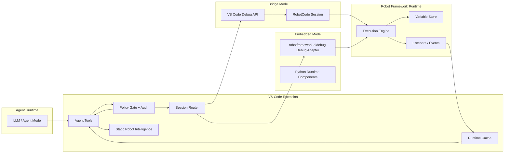

# Context Map

## Relationships

| Upstream | Downstream | Relationship | Why |
|---|---|---|---|
| Agent Experience | Session Orchestration | Customer/Supplier | tools need stable transport-neutral operations |
| Session Orchestration | Runtime Debug Control | Customer/Supplier | live data and commands are downstream runtime concerns |
| Agent Experience | Static Robot Intelligence | Customer/Supplier | grounding and suggestions need editor-time context |
| Governance | Agent Experience | Conformist | tool availability must reflect policy results |
| Governance | Runtime Debug Control | Conformist | runtime execution must obey the same policy rules |
| Packaging And Distribution | all contexts | Published Language | install, compatibility, and version rules affect every boundary |

## Key Boundary Decisions

1. `Session Orchestration` must not know whether the runtime is bridged or embedded beyond capability metadata.
2. `Static Robot Intelligence` and `Runtime Debug Control` are separate contexts because one is paused-runtime truth and the other is source-analysis truth.
3. `Governance` is cross-cutting but not optional. It is not a utility layer.
