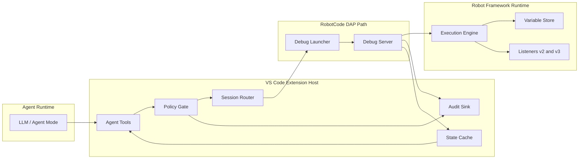

# Context Map

## Upstream And Downstream Relationships

| Context | Relationship | Notes |
|---|---|---|
| Agent Interaction -> Debug Session Orchestration | Customer/Supplier | tools depend on stable routing and request semantics |
| Debug Session Orchestration -> Robot Execution Control | Customer/Supplier | extension requests rely on server-side behavior |
| Governance -> Agent Interaction | Conformist | tool availability conforms to policy decisions |
| Governance -> Robot Execution Control | Conformist | execution requests must pass policy checks server-side too |
| Robot Execution Control -> Robot Framework Runtime | Anti-corruption layer | RobotCode translates domain requests into Robot Framework semantics |

## External Systems

### VS Code Debug Platform

Provides session lifecycle, debug custom events, and `customRequest()` transport.

### Robot Framework Runtime

Provides parsing, execution, listeners, variable replacement, and expression evaluation semantics.

### Optional HTTP Or MCP Gateway

This is an external downstream consumer of the same application layer. It is not part of the core model and should remain disabled by default.
