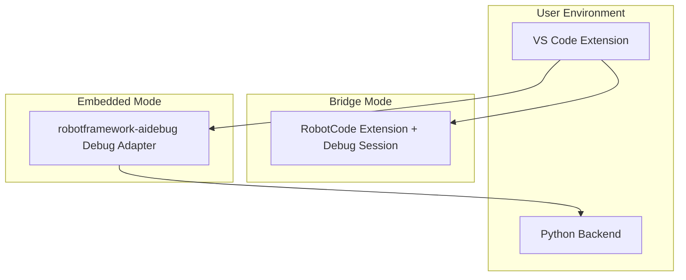

# Modes And Deployment

## Operating Modes

### Bridge Mode

The extension detects an active RobotCode debug session and uses the VS Code debug API to call live DAP requests.

#### Strengths

- fastest path to real live debugging
- reuses RobotCode's mature runtime behavior
- low initial implementation cost

#### Risks

- depends on RobotCode installation and compatibility
- requires careful handling of custom events and `robot/sync`
- some capabilities are only available through existing `evaluate` semantics until structured requests exist

### Embedded Mode

The extension contributes its own debug type and launches its own adapter. The backend reuses RobotCode Python packages when practical.

#### Strengths

- full product independence
- first-class ownership of request schemas and UX
- no Marketplace dependency on RobotCode

#### Risks

- more implementation and release work
- compatibility management against upstream Python packages
- broader test surface

## Control Modes

### `off`

No live agent control. Only explanatory status about why the feature is unavailable.

### `readOnly`

State reads, stack inspection, scopes, variable reads, and static context are allowed. No mutation or runtime execution.

### `fullControl`

All supported read and write operations are available under policy, rate-limit, and timeout constraints.

## Deployment Topology

## Version Compatibility Policy

1. Extension and backend versions must declare a supported compatibility range.
2. Bridge-mode capability probes must gate features on RobotCode version and detected request support.
3. Embedded mode must pin or range-limit upstream Python package versions explicitly.
