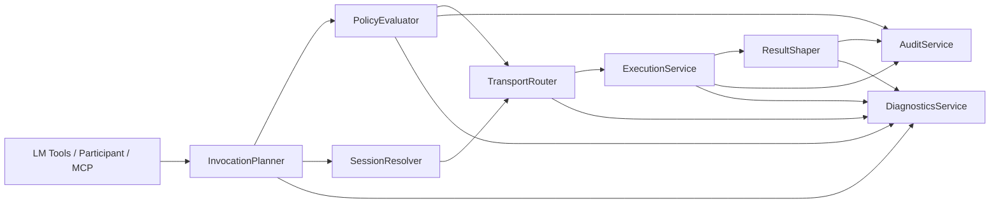

# Chat Agents Shared Core Architecture

## Purpose

This document defines the `M1` shared application layer for chat-agent integration.

The shared core is the transport-neutral boundary behind:

- VS Code LM tools
- chat participant orchestration
- MCP tools

Its job is to make host surfaces thin and keep policy, routing, shaping, and audit behavior consistent.

## Design Goals

1. one canonical execution path per tool invocation
2. no host-specific business rules inside the core
3. bridge, embedded, and fallback runtimes hidden behind stable interfaces
4. policy and audit enforced before and after runtime execution
5. bounded results by default
6. deterministic routing and diagnosable failures

## Core Modules

| Module | Responsibility |
| --- | --- |
| `ToolRegistry` | maps canonical tool ids to contract metadata |
| `InvocationPlanner` | normalizes host requests into invocation plans |
| `PolicyEvaluator` | decides allow, deny, or confirm |
| `SessionResolver` | resolves target session and frame context |
| `TransportRouter` | selects bridge, embedded, or fallback runtime path |
| `ExecutionService` | invokes runtime operations through transport-neutral ports |
| `ResultShaper` | applies truncation, redaction, and budget controls |
| `AuditService` | emits audit records and correlation metadata |
| `DiagnosticsService` | produces structured logs and metrics |

## Dependency Rules

1. Host surfaces depend on the shared core, not the reverse.
2. The shared core depends only on ports/interfaces for runtime and host integrations.
3. Runtime adapters implement shared-core ports.
4. Result shaping and policy evaluation must not call host APIs directly.
5. Audit and diagnostics sinks must be injectable.

## Layer Diagram

## Required Ports

## Runtime Ports

| Port | Methods |
| --- | --- |
| `SessionQueryPort` | `list_sessions`, `get_active_session`, `get_session_state` |
| `VariablePort` | `get_variables_snapshot`, `set_variable` |
| `ContextPort` | `get_runtime_context`, `get_capabilities` |
| `ExecutionPort` | `execute_keyword`, `execute_snippet`, `control_execution` |
| `AuditQueryPort` | `get_audit_log` |

## Cross-Cutting Ports

| Port | Methods |
| --- | --- |
| `PolicyStatePort` | `get_control_mode`, `is_workspace_trusted` |
| `AuditSinkPort` | `emit_audit_event` |
| `MetricsSinkPort` | `record_metric` |
| `LoggerPort` | `info`, `warn`, `error`, `debug` |
| `ClockPort` | `now` |
| `IdGeneratorPort` | `new_correlation_id` |

## Host Adapter Responsibilities

Host adapters are responsible only for:

- converting host input into canonical request shapes
- forwarding host cancellation signals
- rendering confirmation UX when the core requires it
- adapting canonical envelopes back into host result forms

Host adapters are not allowed to:

- decide tool semantics
- bypass policy
- talk directly to runtime transports for production flows
- invent host-only hidden tool ids

## Runtime Adapter Responsibilities

Runtime adapters are responsible for:

- bridge-mode runtime calls
- embedded-mode runtime calls
- fallback/demo-mode runtime calls where applicable
- mapping upstream transport/runtime errors into canonical failures

Runtime adapters are not allowed to:

- suppress audit-required operations
- return unbounded host-facing payloads
- redefine policy classes

## Service Lifecycle

### Construction

The shared core should be constructed once per extension/backend process with injected ports and configuration.

### Invocation Lifecycle

Each invocation creates:

- one correlation id
- one invocation plan
- zero or more audit events
- one final canonical result envelope

### Disposal

The core must not hold stale session references beyond the active invocation unless a dedicated cache layer is introduced with explicit invalidation rules.

## Configuration Inputs

Required configuration:

- control mode default
- token budget defaults
- timeout defaults by tool class
- transport preference defaults
- audit retention settings
- HTTP exposure settings if MCP HTTP exists

## Non-Goals

- host UI composition
- custom LLM provider logic
- remote collaborative locking semantics
- multi-step autonomous planning inside the core itself
