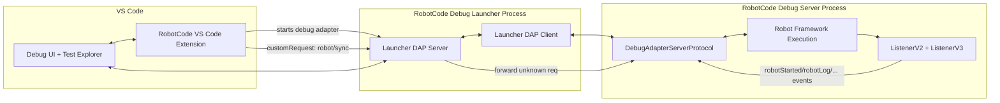
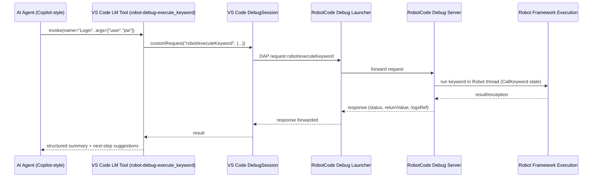
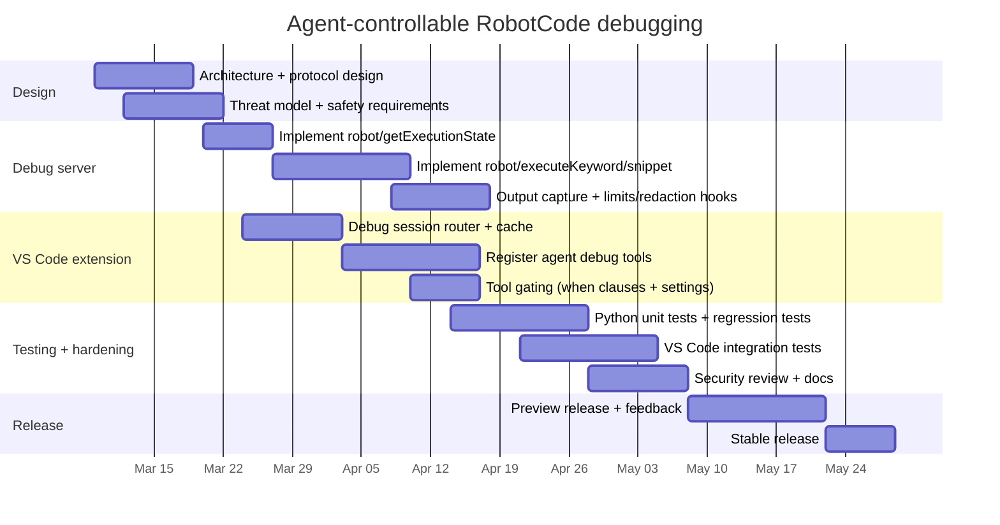

# AI-Controllable Robot Framework Debugging in VS Code for RobotCode

## Executive summary

RobotCode already ships a Debug Adapter Protocol (DAP)–compatible debugger for Robot Framework tests and a VS Code extension that launches and mediates debug sessions via a dedicated “debug launcher” process. The launcher starts the actual RobotCode debug server (which runs Robot Framework) and forwards DAP requests/events between VS Code and the debug server. This architecture is visible in the repo’s debugger launcher implementation and the VS Code extension’s debug adapter descriptor factory. citeturn31view1turn29view0turn43search1

RobotCode’s debug server already supports core DAP requests like `stackTrace`, `scopes`, `variables`, `evaluate`, `setVariable`, and stepping controls, and it has an interactive REPL-like evaluation mechanism capable of executing Robot Framework “test body” snippets and keyword calls while paused. It also emits custom Robot execution events (e.g., suite/test lifecycle, log messages) that the VS Code extension consumes and acknowledges using a “sync” handshake to avoid stalling the running test. citeturn11view0turn10view0turn11view2

In parallel, the VS Code extension already exposes Language Model tools through `vscode.lm.registerTool` and declarative `languageModelTools` contributions, enabling AI agents (including Copilot-style agent mode) to call deterministic tools. This provides a first-class—and vendor-neutral—attachment point for an AI agent to interact with a live Robot debug session. citeturn26view2turn27view0turn43search2

The recommended solution is to add an **Agent Debug Control layer** inside the VS Code extension that exposes a small set of **debug-session tools** (read state, inspect variables, set variables, evaluate expressions, execute keywords/snippets, and control stepping). These tools call into the active RobotCode debug session using VS Code’s debug APIs and DAP `customRequest` messaging. To make “AI-driven execution” safer and more structured than free-form `evaluate`, add a minimal set of **RobotCode-specific DAP custom requests** (forwarded automatically by the debug launcher) for “execute keyword”, “execute snippet”, and “variables snapshot”. citeturn43search0turn31view1turn43search2

Implementation must explicitly account for Robot Framework’s public API surface (e.g., `robot.api` parsing/model APIs, variable replacement APIs, and listener interface versioning), and the design should prefer stable interfaces where possible while acknowledging that debugging typically needs some Robot Framework internals. citeturn44search2turn44search3turn44search0

## Repository and debugger architecture analysis

RobotCode’s debugger is split into three cooperating layers:

**Debug UI client (VS Code debug UI)** → **Debug launcher (RobotCode “debug-launch”)** → **RobotCode debug server (“debug”) embedding Robot Framework execution**. The debug launcher runs as the VS Code debug adapter process (stdio/tcp/pipe modes) and spawns the RobotCode debug server on a free local TCP port, then forwards DAP requests/events. Unknown requests received by the launcher are forwarded to the underlying debug server, which is crucial for extending the protocol with custom Robot-specific requests without rewriting the launcher. citeturn31view1turn29view0turn43search1

The VS Code extension’s `DebugAdapterDescriptorFactory` chooses how to run the debug launcher (stdio/tcp/named pipe) and supports “attach” mode to connect to an already-running debug server. This is also where RobotCode integrates optional Python-level debugging via debugpy by responding to custom events like `debugpyStarted` and auto-attaching a child Python debug session. citeturn29view0turn29view1

The RobotCode debug server implements a DAP server (`DebugAdapterServerProtocol`) that registers DAP commands via `@rpc_method` handlers including `initialize`, `attach`, `setBreakpoints`, `configurationDone`, stepping requests, `stackTrace`, `scopes`, `variables`, `evaluate`, `setVariable`, `setExceptionBreakpoints`, and `completions`. It also defines a RobotCode-specific request `robot/sync` used as an acknowledgement mechanism for certain “synced” events. citeturn11view0turn11view1

Robot Framework lifecycle and logging signals are bridged to the debugger using Robot Framework listeners. RobotCode registers both Listener API v2 and v3 listeners when starting Robot Framework (`--listener robotcode.debugger.listeners.ListenerV3` and `--listener robotcode.debugger.listeners.ListenerV2`). Those listeners send custom debug “events” like `robotStarted`, `robotEnded`, `robotEnqueued`, `robotLog`, and `robotMessage`, while also grouping output for a richer debug console experience. citeturn11view2turn10view0turn34search3

The VS Code extension’s test controller code subscribes to custom debug session events (including the Robot lifecycle/log events) and, if an event body declares `synced`, explicitly acknowledges it with a `customRequest("robot/sync")`. This handshake is required because the debug server can block (up to a timeout) waiting for that acknowledgement when emitting “synced” events. citeturn11view0turn10view0

### Current architecture diagram



## Proposed design for AI-agent interaction

### Design goals

The AI agent must be able to:

- **Observe execution state**: paused/running, stop reason, current suite/test/keyword, stack frames, recent log/output.
- **Inspect variables**: list scopes, retrieve named/indexed children, safely format/limit output.
- **Modify variables**: set variable values in appropriate scope (local/test/suite/global), with safe parsing.
- **Execute keywords/commands**: run a keyword or a snippet of Robot Framework “test body” statements while paused (or in a controlled “call keyword” state).
- **Control execution**: continue, pause, step over/in/out.

The repo already has most underlying primitives: DAP `variables` + `setVariable`, DAP `evaluate` with REPL-like execution, and the event system used for Robot lifecycle/log events. The missing pieces are primarily: (a) a **stable tool API** AIs can call, and (b) a **structured protocol** for keyword execution and state snapshots that is safer than free-form evaluate. citeturn11view0turn10view0turn43search2

### Core approach: VS Code Language Model tools + DAP requests

RobotCode already registers Language Model tools (e.g., library/keyword documentation) using `vscode.lm.registerTool`. Add a small set of **debug tools** implemented as `vscode.LanguageModelTool`s and declared in `package.json` `contributes.languageModelTools`, with a `when` clause so they are available only during Robot debugging. This matches the VS Code tools guidance (tools can be restricted, and debugging tools should only appear while debugging). citeturn26view2turn27view0turn43search2

Each tool will:

1. Identify the active RobotCode debug session (`vscode.debug.activeDebugSession` filtered to type `robotcode`, or by storing a “current robot session” reference on debug start events).
2. Send standard DAP requests using `debugSession.customRequest(command, args)` for:
   - `stackTrace`, `scopes`, `variables`, `evaluate`, `setVariable`, `continue`, `pause`, `next`, `stepIn`, `stepOut`.
3. Send RobotCode-specific DAP custom requests for structured operations (see next section).

This uses the DAP as the protocol boundary, aligning with DAP’s contract and keeping the “AI integration” strictly in the editor layer rather than inside Robot Framework itself. citeturn43search0turn43search1turn11view0

### Structured “agent-safe” custom requests

While `evaluate` already supports REPL-like execution (RobotCode’s docs describe an interactive environment, and the debugger server exposes DAP `evaluate`), a free-form evaluate channel is not ideal for agents because it mixes:
- variable inspection,
- keyword execution,
- multi-line snippet execution,
- and potentially ambiguous parsing. citeturn34search3turn11view0

Instead, introduce RobotCode-specific DAP custom requests that are:

- **Structured**: JSON schema inputs, explicit fields (keyword name, args, assignment, timeout).
- **Gated**: only allowed when the session is paused (or in a dedicated “call keyword” state).
- **Auditable**: each request can emit a corresponding custom event “robot/agentAction” for logging.

Because the debug launcher forwards unknown requests to the debug server, these can be implemented only in the debug server and immediately available in VS Code without modifying the launcher. citeturn31view1turn11view0

### Optional: MCP/HTTP bridge for non-VS Code agents

Some tools/editors do not support VS Code’s Language Model tool API. A separate optional bridge can expose the same operations via a local-only HTTP server (or MCP server) hosted by the extension’s Node runtime, which in turn calls the same DAP requests. This gives “Copilot-like or similar” agents a standardized integration path even outside VS Code’s tool ecosystem, while keeping the canonical implementation inside the RobotCode extension. citeturn43search2turn43search16

### Proposed architecture diagram

```mermaid
flowchart TB
  subgraph VS[VS Code Extension Host]
    LM[Agent Debug Tools (LanguageModelTool)]
    DS[Debug Session Router]
    CACHE[State Cache (events + snapshots)]
    HTTP[Optional Local MCP/HTTP Gateway]
  end

  subgraph DAP[DAP Boundary]
    VSC[VS Code Debug UI / DAP client]
    LA[RobotCode Debug Launcher]
    DA[RobotCode Debug Server]
  end

  LM --> DS
  HTTP --> DS
  DS -->|customRequest: DAP std| LA
  DS -->|customRequest: robot/*| LA
  LA --> DA

  DA -->|events: stopped/output/robotStarted| LA
  LA -->|custom events| VSC
  VSC -->|onDidReceiveDebugSessionCustomEvent| CACHE
  CACHE --> LM
```

### Execution sequence for an AI keyword call



## Protocol mappings and API surface

### Mapping Robot Framework execution to DAP concepts

RobotCode uses Robot Framework listeners (v2 and v3) to observe suite/test/keyword/log events and sends them to the debug client as custom DAP events such as `robotStarted`, `robotEnded`, `robotEnqueued`, `robotLog`, and `robotMessage`. The debug server marks some of these events as “synced” and expects the client to acknowledge them with `robot/sync`. citeturn10view0turn11view0turn11view2

Robot Framework’s listener interface versions (2 and 3) are a formal part of the Robot Framework extension surface: v2 provides string/dict data; v3 provides live model objects that can be inspected and (to some extent) modified. RobotCode uses both. citeturn44search0turn44search20turn10view0

A practical mapping for agent-facing operations is:

| Robot Framework concept | RobotCode signal/source | DAP concept | Used for agent tooling |
|---|---|---|---|
| Suite start/end | ListenerV2 `start_suite/end_suite`, ListenerV3 suite notifications | Custom DAP events `robotStarted` / `robotEnded` | Determine current suite, build a run tree, contextual summaries |
| Test start/end | ListenerV2 `start_test/end_test` | Custom DAP events `robotStarted` / `robotEnded` with `type="test"` | Identify active test, failure context |
| Keyword start/end | ListenerV2 `start_keyword/end_keyword` + debugger stack maintenance | Stack frames (`stackTrace`) + `stopped` events | “Where am I?” reasoning and targeted variable inspection |
| Log / message | ListenerV2 `log_message/message` | Custom DAP events `robotLog` / `robotMessage` + console output | Provide agent with recent logs/errors |
| Variable scopes | Robot execution context variables | DAP scopes + variables | Agent variable exploration |
| Pause/step | Debugger state machine | DAP `pause`, `continue`, `next`, `stepIn`, `stepOut` | Agent-controlled stepping |
| Execute keyword/snippet | Debugger evaluation in Robot thread | DAP `evaluate` or custom `robot/*` requests | Agent “try this keyword” loop |

### Mapping DAP operations to RobotCode operations

DAP defines standard requests/events like `initialize`, `setBreakpoints`, `stackTrace`, `scopes`, `variables`, `evaluate`, and `setVariable`, which RobotCode implements in its debug server. citeturn43search0turn11view0turn11view1

A focused mapping for agent capabilities:

| Agent operation | VS Code API call | DAP request | RobotCode debug server handler | Notes |
|---|---|---|---|
| Get current call stack | `session.customRequest("stackTrace", …)` | `stackTrace` | `_stack_trace` → debugger stack logic | Include `threadId` “RobotMain” |
| List scopes for a frame | `customRequest("scopes", …)` | `scopes` | `_scopes` | Local/Test/Suite/Global scopes provided citeturn11view0 |
| Read variables | `customRequest("variables", …)` | `variables` | `_variables` | Supports named/indexed paging citeturn11view0 |
| Evaluate expression / run snippet | `customRequest("evaluate", …)` | `evaluate` | `_evaluate` | Supports both REPL and expression semantics citeturn11view0 |
| Set variable | `customRequest("setVariable", …)` | `setVariable` | `_set_variable` | Requires `variablesReference` and `name` citeturn11view0 |
| Step/continue/pause | `customRequest("next"/"continue"/"pause", …)` | standard DAP | corresponding RPC methods | Must handle “paused only” constraints |

### Proposed RobotCode custom DAP requests

These are **additive** and can be implemented in the debug server (`packages/debugger/src/robotcode/debugger/server.py`) without breaking existing clients. Because the launcher forwards unknown commands, it will pass these through automatically. citeturn31view1turn11view0

**Custom request: `robot/getExecutionState`**  
Purpose: allow an agent to reliably query a compact “what’s happening now?” snapshot.

- **Args**
  - `includeStack?: boolean`
  - `includeScopes?: boolean`
  - `maxLogLines?: number`
- **Response**
  - `state: "running"|"paused"|"stopped"`
  - `threadId: number`
  - `stopReason?: string`
  - `topFrame?: { id, name, source, line, column }`
  - `currentItem?: { type:"suite"|"test"|"keyword", id, name, source, lineno }`
  - `recentEvents?: Array<{event, body, ts}>`

**Custom request: `robot/executeKeyword`**  
Purpose: structured keyword invocation (safer than free-form expression parsing).

- **Args**
  - `keyword: string`
  - `args?: string[]`
  - `assign?: string[]` (e.g., `"${x}"`, `"@{list}"`)
  - `frameId?: number` (optional; default top frame)
  - `timeoutSec?: number`
  - `captureLog?: boolean`
- **Response**
  - `status: "PASS"|"FAIL"`
  - `returnValueRepr?: string`
  - `assigned?: Record<string, string>` (reprs)
  - `logRef?: number` (optional pointer to captured output)

**Custom request: `robot/executeSnippet`**  
Purpose: run a multi-line Robot “test body” snippet (IF/FOR/Run Keyword…).

- **Args**
  - `snippet: string` (may include newlines)
  - `frameId?: number`
  - `timeoutSec?: number`
- **Response**
  - `status: "OK"|"ERROR"`
  - `resultRepr?: string`
  - `error?: string`

**Custom request: `robot/getVariablesSnapshot`**  
Purpose: retrieve a scoped variable snapshot in one call (with limits/redaction).

- **Args**
  - `frameId?: number`
  - `scopes?: Array<"local"|"test"|"suite"|"global">`
  - `maxItems?: number`
  - `redactPatterns?: string[]`
- **Response**
  - `variables: { local?: {...}, test?: {...}, suite?: {...}, global?: {...} }`
  - `truncated?: boolean`

### VS Code Language Model tools “endpoints”

Declare and register these additional tools in the extension:

- `robot-debug-get_state`
- `robot-debug-get_stack`
- `robot-debug-get_scopes`
- `robot-debug-get_variables`
- `robot-debug-evaluate`
- `robot-debug-set_variable`
- `robot-debug-execute_keyword`
- `robot-debug-execute_snippet`
- `robot-debug-control` (continue/pause/step)

They should be restricted with a `when` clause so they are only available during an active RobotCode debug session, consistent with VS Code’s tool API guidance. citeturn43search2turn26view2

### Optional HTTP endpoints

If an external agent needs access without VS Code tool support, expose a local-only gateway (default off):

- `GET /v1/session` → execution state snapshot
- `POST /v1/execute/keyword` → execute keyword
- `POST /v1/execute/snippet` → execute snippet
- `GET /v1/stack` → stack trace
- `GET /v1/scopes?frameId=…`
- `GET /v1/variables?ref=…&filter=named&start=…&count=…`
- `POST /v1/variables/set` → set variable
- `GET /v1/events/recent?max=…`

The gateway implementation should call into the active debug session via DAP, not connect directly to Robot Framework, so it remains consistent with the editor’s ground truth.

## Security and privacy model

### Threat model

An AI agent interacting with a live test runtime introduces risks beyond “read-only code assistance”:

- **Secret exposure**: variables may include credentials, tokens, or customer data; debug logs may contain sensitive payloads.
- **Unsafe side effects**: executing keywords may trigger real-world actions (UI clicks, API calls, database writes).
- **Prompt/tool injection**: a test log line or variable content might include text that manipulates agent behavior.
- **Remote exfiltration**: some AI agents (or Copilot-like models) may process tool outputs in the cloud, depending on configuration.

These risks are amplified because Robot Framework variables and keywords are designed for automation and can directly interact with external systems. Robot Framework itself supports variable scoping and setting variables dynamically via BuiltIn keywords; this is powerful but must be gated when exposed to agents. citeturn44search1turn44search4turn44search3

### Controls and guardrails

**Capability gating and “paused-only” enforcement**
- Only allow `executeKeyword` / `executeSnippet` when the debug session is paused (or in a dedicated safe “call keyword” mode).
- Only allow `set_variable` operations when paused, and require explicit scope selection. RobotCode already supports `setVariable` at the DAP layer and internally validates variable existence and reference IDs; extend this with stricter checks for agent calls. citeturn11view0

**Workspace trust and explicit opt-in**
- Use VS Code Workspace Trust: tools should be disabled in untrusted workspaces, or limited to read-only inspection.
- Add a setting: `robotcode.agentDebug.enabled` (default `false`), plus `robotcode.agentDebug.mode` = `off|readOnly|fullControl`.

**User confirmation and transparency**
- Use `prepareInvocation` on tools to show a clear “invocation message” describing the action (e.g., “Execute keyword ‘Login’ with args …”) and require user confirmation where the host UI supports it. RobotCode already uses `prepareInvocation` patterns for existing tools. citeturn27view0turn43search2

**Redaction and output minimization**
- Provide configurable redaction regexes (e.g., names containing `TOKEN|PASSWORD|SECRET`) and value truncation limits (max chars, max items).
- Default behavior: return *summaries* and only expand values on explicit agent request.

**Auditing**
- Emit an internal “agent action log” to the RobotCode output channel: timestamp, tool name, parameters (redacted), success/failure.
- Optionally emit a custom DAP event `robot/agentAction` for traceability in telemetry-free local logs.

**Rate limiting**
- Prevent rapid loops that can destabilize the debug session (e.g., “execute keyword” thousands of times). Enforce per-session quotas (e.g., max 30 agent executions/minute).

### Privacy posture for “Copilot-like” agents

VS Code’s Language Model tools are designed to integrate with agent mode and can be called by chat/agent experiences. However, tool outputs may still be included in prompts or transmitted to a model provider depending on the user’s agent configuration. The safest baseline is therefore opt-in + redaction + least-privilege tool availability. citeturn43search2turn43search3turn43search16

To support enterprise setups, document a “local-only” configuration: disable cloud agent calls, enable only local LMs (if available), and keep the optional HTTP gateway disabled by default.

## Implementation plan, code changes, tests, and migration timeline

### Recommended prioritized tasks

1. Implement the **VS Code Agent Debug Tools** (read-only first): stack, scopes, variables, state snapshot, recent log/events.
2. Add **structured keyword/snippet execution** via custom DAP requests (`robot/executeKeyword`, `robot/executeSnippet`) with paused-only enforcement.
3. Add **safe variable setting** tool that targets specific scope and uses DAP `setVariable` (and optionally a higher-level `robot/setVariableInScope` custom request for clarity).
4. Add **security controls**: opt-in, workspace-trust gating, redaction config, rate limiting, audit logging.
5. Add **tests**: python unit tests for custom requests; VS Code extension integration tests for tool dispatch; end-to-end debug-session tests.
6. Documentation + migration guide + sample “agent workflows” (e.g., “reproduce failure → inspect variables → execute diagnostic keyword → patch variable”).  

### Key code changes

#### Debug server: add RobotCode custom requests (Python)

Target file: `packages/debugger/src/robotcode/debugger/server.py` already registers DAP handlers via `@rpc_method` and includes `robot/sync`. citeturn11view0

Patch sketch (illustrative):

```diff
diff --git a/packages/debugger/src/robotcode/debugger/server.py b/packages/debugger/src/robotcode/debugger/server.py
index 1234567..89abcde 100644
--- a/packages/debugger/src/robotcode/debugger/server.py
+++ b/packages/debugger/src/robotcode/debugger/server.py
@@ -1,6 +1,7 @@
 import asyncio
 import os
 import signal
+import time
 import threading
 from typing import Any, Callable, Dict, List, Literal, Optional, Union

@@
 class DebugAdapterServerProtocol(DebugAdapterProtocol):
@@
     @rpc_method(name="robot/sync", threaded=True)
     def _robot_sync(self, *args: Any, **kwargs: Any) -> None:
         self.sync_event.set()

+    @rpc_method(name="robot/getExecutionState")
+    async def _robot_get_execution_state(self, includeStack: bool = True, maxLogLines: int = 50, **_: Any) -> Dict[str, Any]:
+        # NOTE: Keep response small and deterministic.
+        state = Debugger.instance.state.name.lower()
+        thread_id = Debugger.instance.main_thread_id
+        top_frame = None
+        if includeStack and Debugger.instance.stack_frames:
+            sf = Debugger.instance.stack_frames[0]
+            top_frame = {
+                "id": sf.id,
+                "name": sf.longname or sf.kwname or sf.name or sf.type,
+                "source": sf.source,
+                "line": sf.line,
+                "column": sf.column,
+                "type": sf.type,
+            }
+        return {
+            "state": state,
+            "threadId": thread_id,
+            "topFrame": top_frame,
+            "ts": time.time(),
+        }
+
+    @rpc_method(name="robot/executeKeyword")
+    async def _robot_execute_keyword(
+        self,
+        keyword: str,
+        args: Optional[List[str]] = None,
+        assign: Optional[List[str]] = None,
+        frameId: Optional[int] = None,
+        timeoutSec: Optional[int] = None,
+        **_: Any,
+    ) -> Dict[str, Any]:
+        # Enforce paused-only for agent execution
+        if Debugger.instance.state.name not in ("Paused", "CallKeyword"):
+            return {"status": "ERROR", "error": "Keyword execution only allowed while paused."}
+        result = Debugger.instance.execute_keyword_structured(keyword, args or [], assign or [], frameId, timeoutSec)
+        return result
+
+    @rpc_method(name="robot/executeSnippet")
+    async def _robot_execute_snippet(self, snippet: str, frameId: Optional[int] = None, **_: Any) -> Dict[str, Any]:
+        if Debugger.instance.state.name not in ("Paused", "CallKeyword"):
+            return {"status": "ERROR", "error": "Snippet execution only allowed while paused."}
+        result = Debugger.instance.execute_snippet(snippet, frameId)
+        return result
```

Notes:
- This patch assumes adding new methods on `Debugger` (see below).
- Because the launcher forwards unknown commands, no launcher patch is required for these new requests. citeturn31view1turn11view0

#### Debugger core: expose structured keyword/snippet execution (Python)

RobotCode already implements REPL-like execution using Robot Framework parsing APIs, and keyword execution uses Robot Framework’s `Keyword` object and runs it in the Robot thread using a `CallKeyword` state. This is the mechanism to reuse for `execute_keyword_structured` and `execute_snippet`. citeturn34search3turn44search2turn44search6

Implementation considerations (important Robot Framework APIs):

- Parsing snippet strings into runnable model objects via `robot.api.parsing.get_model` and then `TestSuite.from_model` / `TestCase` manipulation. citeturn44search6turn44search2
- Variable replacement and expression evaluation via `robot.variables` replacer APIs (e.g., `replace_scalar`, `replace_string`) and `evaluate_expression`. citeturn44search3turn44search22
- Listener API versioning and model objects if using v3 for richer context. citeturn44search0turn44search20
- Variable scope semantics: Robot Framework supports setting variables in local/test/suite/global scopes via BuiltIn keywords; ensure the debugger’s variable-setting semantics align with these scoping rules (or explicitly document differences). citeturn44search1turn44search4

Patch sketch (illustrative; details depend on existing helper methods in `Debugger`):

```diff
diff --git a/packages/debugger/src/robotcode/debugger/debugger.py b/packages/debugger/src/robotcode/debugger/debugger.py
index 1111111..2222222 100644
--- a/packages/debugger/src/robotcode/debugger/debugger.py
+++ b/packages/debugger/src/robotcode/debugger/debugger.py
@@
 class Debugger:
@@
+    def execute_keyword_structured(
+        self,
+        keyword: str,
+        args: List[str],
+        assign: List[str],
+        frame_id: Optional[int],
+        timeout_sec: Optional[int],
+    ) -> Dict[str, Any]:
+        # Resolve execution context for frame
+        stack_frame, evaluate_context = self._get_evaluation_context(frame_id)
+        if evaluate_context is None:
+            return {"status": "ERROR", "error": "No execution context available."}
+
+        # Reuse existing “keyword expression” execution model:
+        # build a Keyword(name=..., args=..., assign=...) and run it in Robot thread
+        def run_kw() -> Any:
+            kw = Keyword(name=keyword, args=tuple(args), assign=tuple(assign))
+            return self._run_keyword(kw, evaluate_context)
+
+        result = self.run_in_robot_thread(run_kw)
+        if isinstance(result, BaseException):
+            return {"status": "FAIL", "error": str(result)}
+        return {"status": "PASS", "returnValueRepr": repr(result)}
+
+    def execute_snippet(self, snippet: str, frame_id: Optional[int]) -> Dict[str, Any]:
+        stack_frame, evaluate_context = self._get_evaluation_context(frame_id)
+        if evaluate_context is None:
+            return {"status": "ERROR", "error": "No execution context available."}
+        try:
+            result = self._evaluate_test_body_expression(snippet, evaluate_context)
+            return {"status": "OK", "resultRepr": repr(result)}
+        except BaseException as e:
+            return {"status": "ERROR", "error": f"{type(e).__name__}: {e}"}
```

#### VS Code extension: add agent debug tools (TypeScript)

RobotCode already registers tools and describes them in `package.json` `contributes.languageModelTools`. Extend those contributions and register new tool instances in `index.ts`, similar to existing `robot-get_*` tools. citeturn26view2turn27view0turn43search2

Key design points:
- Maintain a **DebugSessionRouter** that selects the active RobotCode session and provides helper methods for DAP calls.
- Return compact text/markdown summaries, not large JSON dumps, unless requested.
- Redact values based on settings before returning tool output.

Tool examples (illustrative):

```ts
// robotDebugTools.ts
import * as vscode from "vscode";

export class RobotDebugGetStateTool implements vscode.LanguageModelTool<{ }> {
  async invoke(_: vscode.LanguageModelToolInvocationOptions, _token: vscode.CancellationToken) {
    const session = vscode.debug.activeDebugSession;
    if (!session || session.type !== "robotcode") {
      return new vscode.LanguageModelToolResult([new vscode.LanguageModelTextPart("No active RobotCode debug session.")]);
    }
    const state = await session.customRequest("robot/getExecutionState", { includeStack: true });
    return new vscode.LanguageModelToolResult([
      new vscode.LanguageModelTextPart(`## Debug State\n\n\`\`\`json\n${JSON.stringify(state, null, 2)}\n\`\`\``),
    ]);
  }
}
```

In `package.json`, add `languageModelTools` entries with a `when` clause to restrict availability to debugging. The VS Code tools documentation explicitly recommends restricting debugging-related tools to only be available while debugging. citeturn43search2turn34search9

#### Keep the existing robot/sync behavior intact

RobotCode’s debug server uses `robot/sync` to coordinate “synced” events, and the VS Code extension already acknowledges synced events via `customRequest("robot/sync")`. AI tooling must not block or interfere with this flow; state caching is okay as long as the acknowledgement is still sent promptly. citeturn11view0turn10view0

### Tests

A realistic test suite should include:

**Python (debug server)**
- Unit tests for `robot/executeKeyword` and `robot/executeSnippet`:
  - “paused-only” enforcement (returns error when running).
  - correct PASS/FAIL mapping and error formatting.
- Unit tests for `robot/getExecutionState`:
  - stable schema, small bounded size.
- Regression tests ensuring existing DAP commands still behave as before (`evaluate`, `setVariable`, stepping).

**VS Code extension**
- Extension tests verifying:
  - tools register only when enabled (feature flag),
  - tools refuse when no active RobotCode session,
  - tools invoke the expected `customRequest` calls and handle responses.

**End-to-end**
- Start a debug session on a small Robot suite, hit a breakpoint, call:
  - variable read,
  - variable set,
  - `robot/executeKeyword` (diagnostic keyword),
  - resume execution and assert expected behavior.

### Migration steps

- Introduce feature flags:
  - `robotcode.agentDebug.enabled` (default `false`)
  - `robotcode.agentDebug.readOnly` (default `true`)
- Ship custom DAP requests in the debug server as backward-compatible additions; older extensions simply won’t call them.
- Ship new VS Code tools disabled by default; document how to enable and how to configure redaction.
- Add documentation emphasizing that agent-driven keyword execution can have side effects (same caution level as manually typing into the debug console/REPL).

### Timeline and milestones



### Alternatives comparison

| Alternative | What it is | Pros | Cons | Recommendation |
|---|---|---|---|---|
| VS Code LM tools calling DAP (recommended) | Extension exposes `vscode.lm.registerTool` tools that call `DebugSession.customRequest` | Native to agent mode; deterministic tools; no extra ports; works with existing RobotCode architecture | Requires VS Code tool support; tool outputs may be used by cloud models | Best default citeturn43search2turn26view2 |
| Pure `evaluate` scripting in debug console | AI only uses the existing `evaluate` request with free-form strings | Zero debug server changes | Hard to make safe/structured; injection-prone; unclear semantics | Not sufficient alone citeturn11view0turn34search3 |
| Custom HTTP/MCP gateway | Local server exposing endpoints that drive DAP | Works for non-VS Code agents; automatable | Adds attack surface; needs auth; more ops/config | Optional add-on citeturn43search16turn43search2 |
| Direct Robot Framework manipulation | Agent talks to Robot Framework internals directly | Maximum power | Most brittle; bypasses debugger; hard to keep consistent with UI | Avoid for primary path citeturn44search2turn44search0 |

## Robot Framework API considerations for implementation

Robot Framework’s **public API** is centered around `robot.api` and is considered stable unless stated otherwise. Parsing APIs (`robot.api.parsing`) provide `get_model()` and related functions returning an AST-like model, which is suitable for constructing or transforming runnable snippets for controlled execution. citeturn44search2turn44search6

Variable replacement and evaluation behavior is formalized in Robot Framework’s variables API: `replace_scalar`, `replace_string`, and expression evaluation (`evaluate_expression`). RobotCode should continue leveraging these APIs to ensure agent-driven evaluation uses the same semantics as Robot Framework itself (rather than ad-hoc parsing). citeturn44search3turn44search22turn44search7

The listener interface is a core extension mechanism. Listener v2 and v3 differ in whether they provide mutable model objects, and Robot Framework 7 defaults to listener v3 if not specified. RobotCode uses both; any extensions to “execution state” should align with listener v3 where live model objects are needed, but keep compatibility with v2. citeturn44search0turn44search20turn10view0

Variable scoping is an important semantic boundary: Robot Framework provides BuiltIn keywords like Set Test Variable / Set Suite Variable / Set Global Variable and defines where those variables are visible and when it is legal to set them. Agent tooling that modifies variables should either:
- operate only through the debugger’s current execution context (and document it), or
- provide explicit scoping controls that match Robot Framework’s scoping rules. citeturn44search1turn44search4

Because debugging necessarily touches execution state, some Robot Framework internals may still be required. Where internals are used, RobotCode should continue its pattern of version-gating behavior (as already done across multiple Robot Framework versions) and restrict agent-exposed operations to stable subsets whenever possible.

